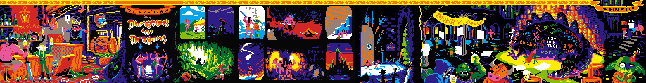
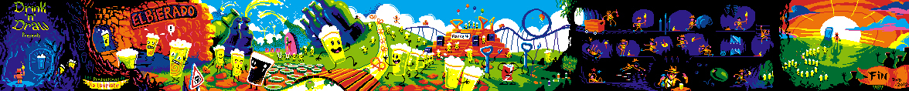

drinkndraw
==========

http://www.drinkanddraw-tlse.org/

Pixel drinks

## Contexte

GOM et Vinz, des potes qui font un jeu de coloriage de pixels 1 fois par mois dans un bar (c'était
à la loupiotte les 2 dernieres années) et qui sont passé au lab hier pour voir comment ils pourraient
numériser un peu ces jeux :) ils ont rencontré luc et passer la soirée a discuter avec lui, luc est
a fond sur meteor js en ce moment, du coup ça serait une espèce de web-app (donc dispo sur tel
android/ios/ffos) de coloriage de pixels.

## Dispositif

Idéalement, le world of d'n'd nécessite :
	- dans le bar
		- un écran qui affiche une page web.
			- la page web présente l'état d'avancement de la fresque

## Définitions

un motif est une grille de 16/32/64/128/256 cases
un motif a une couleur dominante de fond
on peut faire varier la couleur dominante pour chaque case du motif suivant deux variantes plus claires et deux vaiante plus sombres en dégradé

la couleur dominante du motif est la couleur médiane dans cet ensemble de 5 teintes

le motif est l'expression d'un pixel de la fresque.
les motifs sont envoyé aux utilisateurs de l'application.

La fresque est composé de tous les pixels.

chaque pixel est un motif.

## cycle

1. un utilisateur reçoit un motif
2. chaque motif a une couleur dominante (la couleur médiane)
3. il colorie
    1. il peut changer la résolution (grille de 16/32/64/128/256
    2. il peut dire qu'il a terminé son dessin (signer le motif)
    3. s'il ne fait rien pendant t seconde
        1. pop-up (avec time out)
        2. si le délai du popup est passé, le motif est rendu à la fresque
    4. il rend le motif
4. le motif est rendu à la fresque
5. retour en 1
